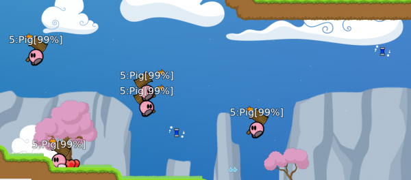
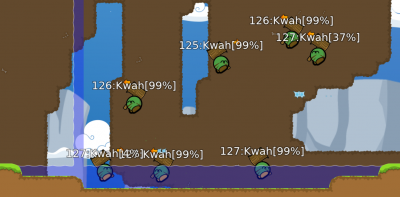
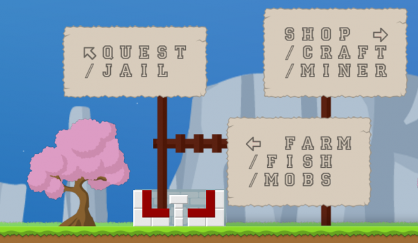
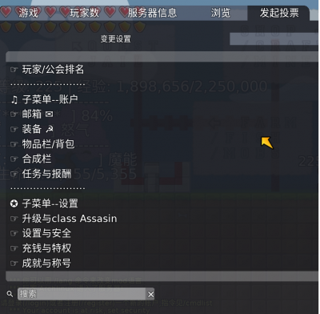
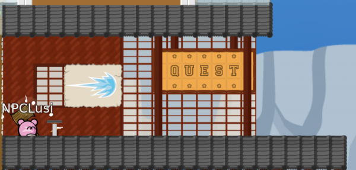

## MMO RPG 模式( mmotee ) 
### 角色扮演模式，玩家通过打怪，种地，挖矿等方式升级以及合成装备等。

1. 入服指南 
按 T 输入 “/register 用户名 密码” 注册，注册成功后输入 “/login 密码” 登录，登录后 esc-加入游戏来正式进入 mmotee 模式。
刚进入游戏时，会有一个选择职业的 UI 界面，这个界面似乎有渲染问题，因此似乎看不到，移动鼠标到一些位置会有公告提示选择的职业。不同职业的初始武器不同，但武器都可以后续购买。berserker 即狂战士的武士刀即为锤子。

 * 升级与物品捡拾 
  * 击杀怪物 
   * 出生点左侧有打怪区域，里面有 5-10+ 级不等的猪，杀死他们会得到经验和钱（需要捡拾掉落的红心和盾牌），还会得到一些以锤子标记的物品，这些物品有归属，只可以捡拾属于自己的物品。锤子标记的物品默认通过锤子捡拾，可以在投票界面中的设置更改为 f3。
   
   * 更深入一些到达更高级的区域会有等级更高的 kwah 和 boom 出现，前者大多在 100 级左右，后者一般在 200 级左右。注意：由出生点右侧通道下去深入会直接到达 boom 所在的区域，而且 boom 会在较大范围内游荡，如果等级较低会很危险。

在 kwah 区域游荡的 boom: 

 * 座椅挂机 
  * 除打怪升级外，地图各处还会有一些座椅，坐在上面会每隔一定时间内加经验和钱，但加的经验和钱都是固定的，在后期便会显得很慢。

 * 耕地 
  * 吃作物可以增加经验，在地图的一些特定位置会有农田，耕作会得到胡萝卜，番茄，土豆等作物，在物品栏中使用它们可以获得根据作物种类不等的经验。耕作收获一定物品后耕作等级会升级，耕作等级越高，每次收获的作物就越多，在后期也能够获得较高的升级效率。

 * 采矿 
  * 采矿也可以增加经验，除普通经验外，采矿等级也能够不断提升。但采矿加的经验较低，不适于快速升级.

 * 装备购买
  * 大多数装备等的购买都要求一定等级，20 级可以购买自动锤子，它可以让玩家在使用锤子时长按即可自动挥锤（包括自动挖矿、收获等）

 * 每次升级之后需要在“升级与职业”界面自己决定属性的增加与技能点的使用。

2.投票菜单 

 * 查看背包 
  * 这个模式很多操作都需要在 esc-投票界面完成，包括背包查看。双击物品栏/背包界面即可查看背包，背包中对物品进行了分类，需要在对应的界面查看物品。

 * 接受任务 
  * 在出生点左上角是任务大厅，在该位置才能够打开任务界面，完成任务进度的查看与提交等。
  

 * 购买物品 
  * 出生点右侧是商店，在该位置投票界面会自动展示商店出售的物品，选择对应的物品双击即可购买（注意等级与金钱的要求）。部分物品（比如武器的模块）购买之后不会立即生效，需要手动在“设置与安全”界面中勾选对应的方框才可以生效。
  [shop](./docs/images/shop.png)

 * 合成 
  * 出生点右下角是合成大厅，在该位置才能够打开合成栏，进行物品的合成，例如不能购买的护甲和镐子，可以在合成大厅合成。合成成功后左下角会出现提示，在邮箱界面可以领取合成的物品。
  [craft_room](./docs/images/craft_room.png)

 * 出售 
  * 在出生点右侧通道下去之后能看到出售处的店铺，在那里可以出售矿石等物品获得黄金。
  [sell_room](./docs/images/sell_room.png)

 * 邮箱，护甲及其他 
  * 在线一定时间后邮箱会收到系统的登录奖励，会奖励一些矿石，铜镐和一些盒子之类的物品。

 * 护甲等装备通过装备菜单进行穿戴查看，不会出现在物品栏/背包中。

 * 钱袋，作物等物品可以在“使用该物品”界面时在右下角投票理由处输入使用数量来一次性打开大量的物品，但物品栏中的一些随机盒子会在打开时随机给予玩家一些物品，这些盒子只能单独打开。
3.金钱系统 
 * 玩家能够在投票界面中看到自己的金钱数量。

 * 玩家只能够得到白银，但游戏中的交易都是通过黄金进行的。玩家每得到 10,000 白银，游戏系统会自动将其换为 1 黄金。

 * 金钱可以通过坐在椅子上得到，也可以通过打怪得到。地图中有一些固定地点会有形如激光子弹状的“钱袋”，这些“钱袋”每隔一定时间数量会增加。玩家触碰到“钱袋”时会得到其自上次被捡拾以来积攒的所有钱袋，之后该“钱袋”会在地图上消失，一定时间后再次生成。一个钱袋打开后会得到随机数量的白银，但该随机算法波动范围较小，一个钱袋打开基本会获得 1 黄金价值相当的白银。

 * 金钱主要用于购买装备，玩家死亡后一些情况会丢失部分金钱。金钱可以捐给公会，用于使公会变强。排名前三的公会会分到地图中的房子（house），房子中通常有椅子，耕地等，不属于该公会的玩家在公会关门时无法进入该公会拥有的房子中。

4.耕地，采矿，伐木与附魔 
 * 耕地 
  * 耕地无需任何工具，只要在相应的耕地上使用锤子，广播中便会提示耕地进程，需要若干次采收才能得到相应的作物，如果是 auto hammer，会每隔固定时间进行一次采收（可以通过广播的进度条查看收获进度）。每次收获时会得到耕地等级数的胡萝卜，番茄或土豆。每使用一个胡萝卜会获得 10 经验，番茄 15 经验，土豆 25 经验。\{\{ :mods:farm_and_材料.png?600 |\}\}

 * 采矿 
  * 采矿一次收获需要的采收次数与使用的工具有关，无工具需要 20 次，铜镐需要 10 次，金镐需要 5 次等。工具在采收一定次数后会损坏，在所有的工具均损坏后会切换为无工具采收。每次收获会提升采矿经验，采矿经验提升到一定数量后会提高等级，随着等级的提高，每次收获得到的矿物也会略有增加，每次收获得到的常规经验也会随等级增加。每提高 50 级则可以收获到下一层次的矿物，lv.0 - lv.50 只能够收获铜矿石，lv.50-lv.100 可以收获铜矿石和铁矿石，lv.100-lv.150 可以收获铜，铁，金矿石，lv.150-lv.200 可以收获铜，铁，金以及钻石矿石。lv.200+ 则可以收获全部种类的矿石，但在 lv.200 以上时收获时如果收获到了龙矿石依然只能获得一个，而不是像其他矿石那样随等级增长。矿石可以用于合成护甲，镐子等，护甲可以增加 HP 上限以及护甲值，镐子可以加快采矿速度。\{\{ :mods:mine_area.png?600 |\}\}

 * 伐木 
  * 地图的树木下通常会有红心，在该处使用锤子可以进行伐木，伐木会获得木头，但伐木没有等级，因此伐木收获的速度不会随着收获木头的增加而变快。\{\{ :mods:mine_and_log.png?400 |\}\}

 * 附魔 
  * 地图有两处带有红心的平台，在红心上使用锤子会收获 材料，材料可以用于附魔，材料的收获会增加萃取经验，随着萃取经验的增加，每次收获得到的材料数量也会增加。物品栏中最多可存放3,000个材料，每次附魔会消耗 1,000个材料，附魔升级有较大概率失败。附魔通过投票界面的装备菜单完成。\{\{ :mods:材料_area.png?600 |\}\}

5. 武器与技能 
 * 武器及升级 
  * 武器及其升级可以在商店买到，升级模块购买了之后需要在设置界面中开启。

 * 武器作用与原版基本一致：锤子，手枪，霰弹，榴弹和激光，assasin（刺客）的 ninja（武士刀）与锤子一致，但没有原版的功能。

 * 可购买的武器升级模块：
  * Hook Damage：钩子伤害
  * Auto Hammer/Gun: 自动锤子/手枪
  * Explode: 击中后爆炸
  * Ghost: 穿墙（只能穿过 hookable tile）
  * Pizdamet: 榴弹的特殊模块，可以将榴弹变为无限弹药攻击距离较长的心型弹药\{\{ :mods:pizdamet.png?400 |\}\}
  * Bounce: 反射
  * Hybrid SGUN: 霰弹的每一发变为前后的两发，大幅增加威力
  * Lamp Hammer: 可以将锤子变为（较短）远程的攻击方式，挥锤时会发出自动追踪的攻击

 * 技能 
  * 每升级一级就会获得2升级点和2技能点，升级点用于增加属性点，技能点可以用来训练技能以及升级职业专属被动。
  * 用技能点获得的主动技能可以在升级与职业界面中设置触发方式，使用技能会消耗魔能，魔能可以通过攻击来补充（补充速率大概与魔能属性点有关）。

   * Skill Sword（剑技，20 技能点），触发后会在光标方向伸出一把较短的激光剑，触碰到的人都会受到伤害，触发后会不断消耗魔能1点直至魔能消耗完毕后消失。
   * Skill Heal（补血技，60 技能点），触发后会有一个由红心和盾牌组成的圆圈，这个圆圈当玩家在可达范围内时会发出红心为玩家补血，一定时间后自动消失，一次触发消耗 50 魔能。\{\{ :mods:skill_heal.png?400 |\}\}
   * Skill Walls（激光墙，70 技能点），触发后会在光标方向建立一堵激光墙，触碰到会受到伤害，当伤害全部转移或玩家退出时激光墙自动消失，被攻击损耗后也会消失，一次触发消耗 30 魔能。\{\{ :mods:skill_wall.png?400 |\}\}
